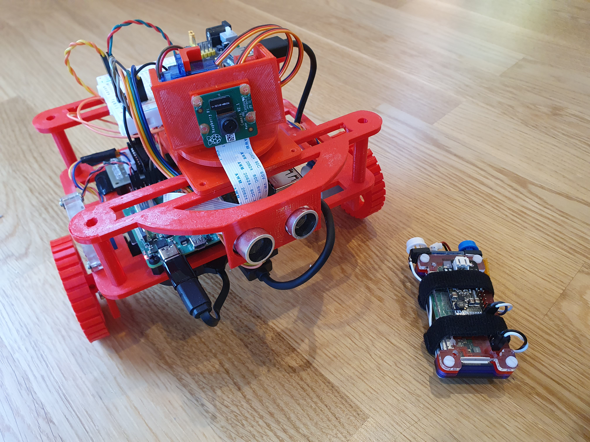
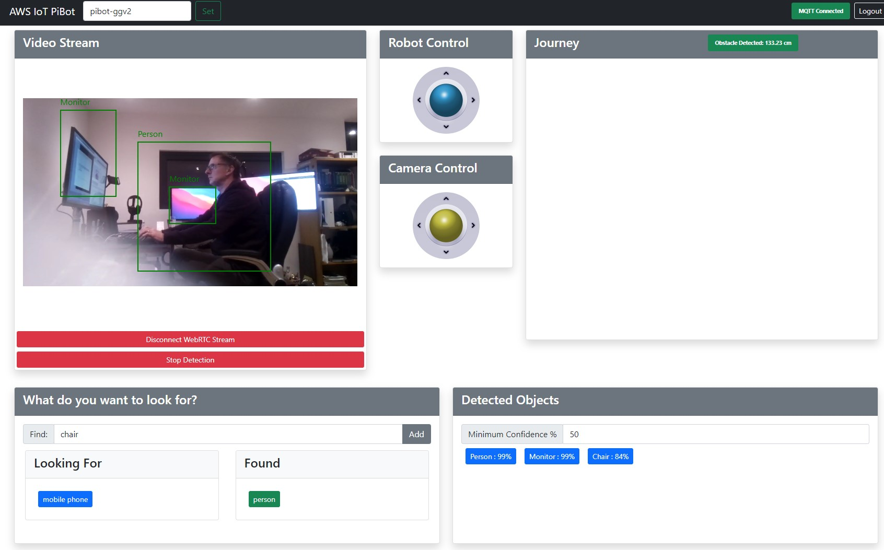
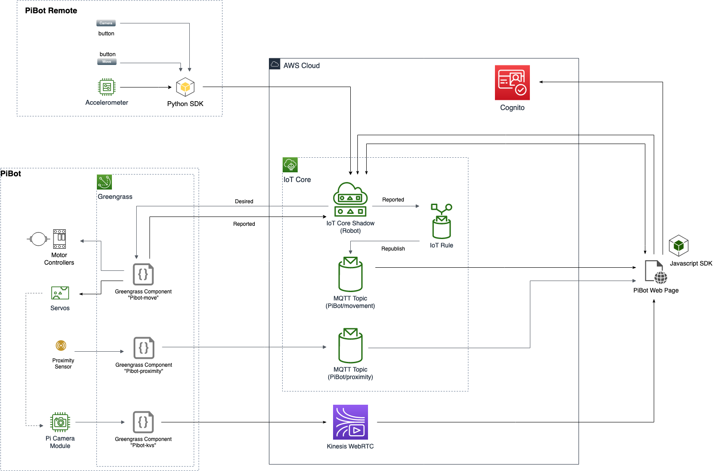
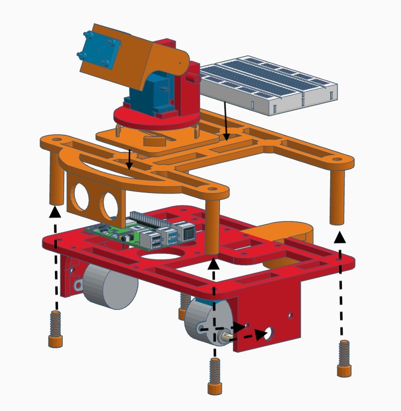
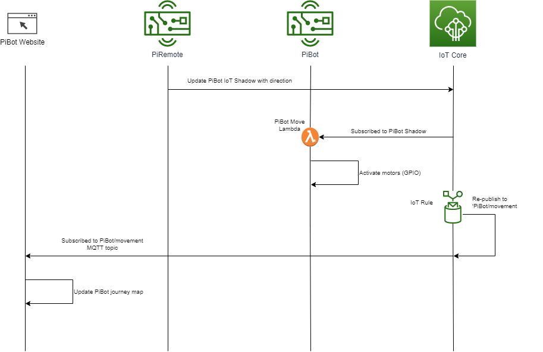
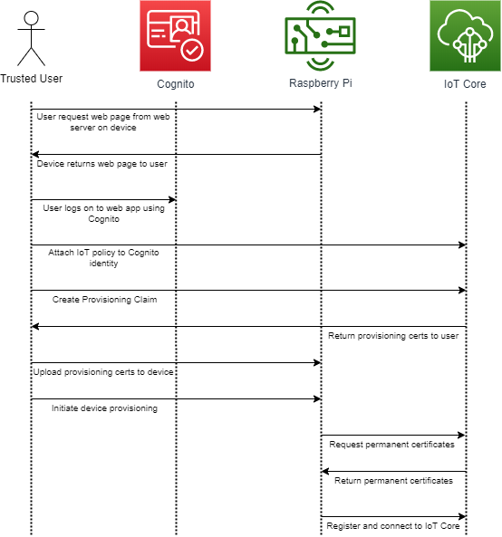
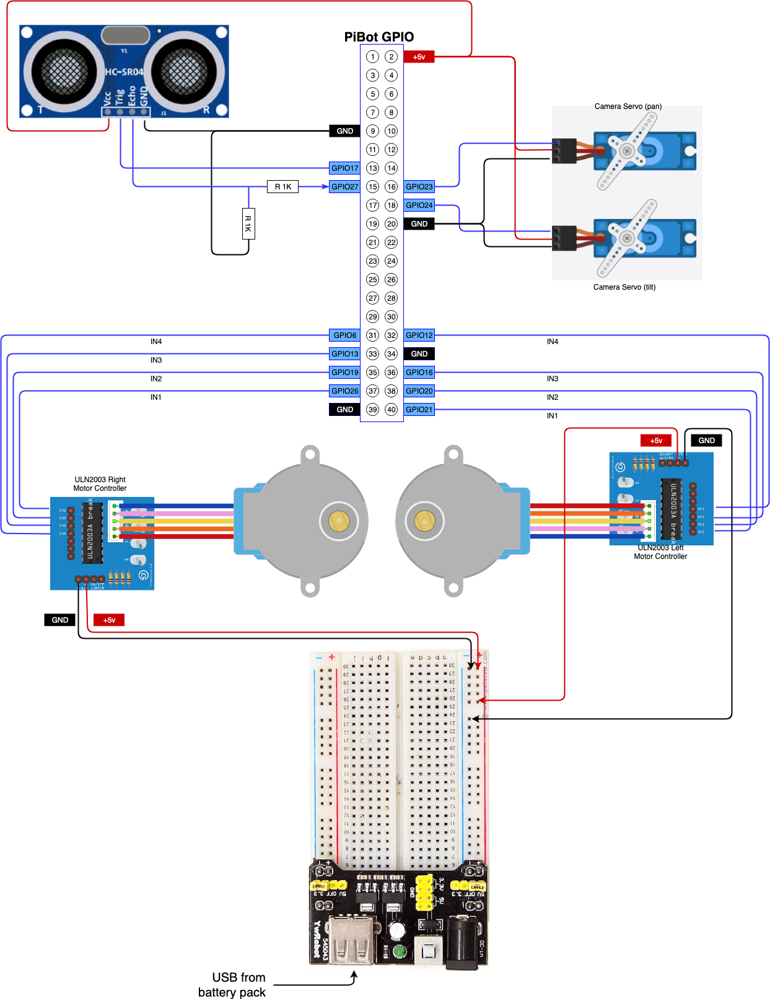
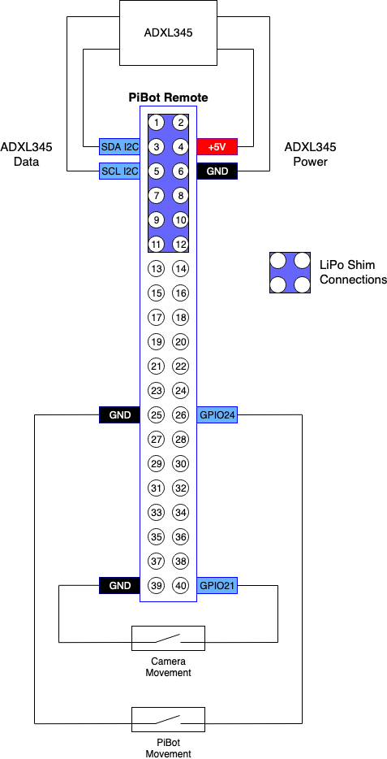

# AWS IoT Robot

The code and kit list in this repository enables the building of an AWS IoT and AWS Greengrass (v2) controlled Raspberry Pi robot.  This repository provides the code and assets for an AWS IoT workshop - please refer to that workshop (URL TBC) for detailed build instructions.

There are a number of physical components required to build the robot itself, and this has been done using readily available and low cost parts to hopefully give more people the opportunity to build their own IoT Robot.

## Introduction

You will need an AWS account in which to build this solution.  The solution demonstrates a number of different capabilities of AWS IoT and different ways of implementing those capabilities with the aim of bringing them together to help understand the different approaches and determine what is the best one for a given situation.

The core components of the solution are:
- A Web site/application - Using Angular, the web app displays robot movements, a WebRTC video stream from the PiBot camera and allows control of the camera direction
- Robot - A Raspberry Pi running AWS IoT Greengrass for managing the Lambda functions that control the PiBot actions
- Remote Control - A second Raspberry Pi (Pi Zero W) acts as a remote controller for the robot, using MQTT for communication over wireless.  The remote uses an accelerometer - you tilt the remote and the robot moves in that direction.

CloudFormation templates are provided to create the core AWS resources and also the AWS IoT specific resources.

## What will you build

A robot :-)

And a web application that can also control and track the robot and receives a video feed from the camera.

## Architecture

The architecture diagram below shows the components of the service:

## Chassis Build

3D printer files are provided for the chassis of the robot, or you can use your own

## How it works

### Communication Flow
The diagram below shows the communication flow between the PiRemote and PiBot, via IoT Core:

### Trusted User Provisioning App

## Parts List
The below list is not exhaustive and covers the key components required.  Additional components such as wheels, wiring, breadboard, batteries will be required to complete the build of a full robot
- Raspberry Pi 3 or 4
- Raspberry Pi Zero W (suggest using Lithium-Polymer battery and Li-Po shim)
- 2 x 28BYJ-48 Stepper Motor
- 2 x ULN2003 Motor Driver Board
- 1 x ADXL 345 Accelerometer
- 1 x HC-SR04 ultra-sonic proximity detector
- 2 x push buttons (normally open)
- 5v Battery pack suitable for driving Pi and motors

## Build

The overall build sequence is as follows:

- Setup a Cloud9 IDE
- Build the physical robot, chassis and electronics
- Create Cognito user pools using CloudFormation template
- Implement Greengrass pre-requisites (IAM roles, Fleet Provisioning Template)
- Build the Trusted User Provisioning application
- Provision the robot as an IoT Thing and Greengrass Core Device
- Install Kinesis WebRTC on the robot
- Create and deploy the Greengrass v2 Components
- Build the physical remote control (optional)
- Build the Robot web application
- Create an IoT rule for re-publishing

### Steps

Please refer to the AWS IoT Workshop (https://catalog.us-east-1.prod.workshops.aws/workshops/446304b7-b946-4c40-b78f-08bf0025d8f6) for detailed and step-by-step build instructions.

#### Wiring for PiBot GPIO Pins

### Setting up PiRemote

The PiRemote uses the AWS SDK to connect to IoT Core, so does NOT need Greengrass installed.  The scripts on the Pi-Remote are Python 3 based - review the scripts for the Pi-zero-remote for the Python modules that you need to install to run the script.

There is no automated provisioning for the remote yet, so you will need to create the certificates in IoT Core for the Pi-Remote Thing and copy them to the device.  Adapting the PiBot Trusted User Provisioning web app should be pretty simple to provision the Pi-Remote in the same way.

#### Wiring for PiBot Remote GPIO Pins

